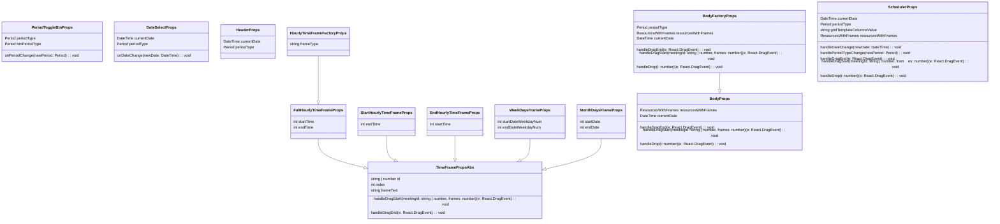

```mermaid
classDiagram
    class PeriodToggleBtnProps {
        Period periodType
        Period btnPeriodType
        onPeriodChange(newPeriod: Period): void
    }

    class DateSelectProps {
        DateTime currentDate
        Period periodType
        onDateChange(newDate: DateTime): void
    }

    class HeaderProps {
        DateTime currentDate
        Period periodType
    }

    class TimeFramePropsAbs {
        string | number id
        int index
        string frameText
        handleDragStart(meetingId: string | number, frames: number) (e: React.DragEvent<HTMLDivElement>): void
        handleDragEnd(e: React.DragEvent<HTMLDivElement>): void
    }

    class FullHourlyTimeFrameProps {
        int startTime
        int endTime
    }

    class StartHourlyTimeFrameProps {
        int endTime
    }

    class EndHourlyTimeFrameProps {
        int startTime
    }

    class HourlyTimeFrameFactoryProps {
        string frameType
    }

    class WeekDaysFrameProps {
        int startDateWeekdayNum
        int endDateWeekdayNum
    }

    class MonthDaysFrameProps {
        int startDate
        int endDate
    }

    class BodyProps {
        ResourcesWithFrames resourcesWithFrames
        DateTime currentDate
        handleDragEnd(e: React.DragEvent<HTMLDivElement>): void
        handleDragStart(meetingId: string | number, frames: number) (e: React.DragEvent<HTMLDivElement>): void
        handleDrop(i: number) (e: React.DragEvent<HTMLDivElement>): void
    }

    class BodyFactoryProps {
        Period periodType
        ResourcesWithFrames resourcesWithFrames
        DateTime currentDate
        handleDragEnd(e: React.DragEvent<HTMLDivElement>): void
        handleDragStart(meetingId: string | number, frames: number) (e: React.DragEvent<HTMLDivElement>): void
        handleDrop(i: number) (e: React.DragEvent<HTMLDivElement>): void
    }

    class SchedulerProps {
        DateTime currentDate
        Period periodType
        handleDateChange(newDate: DateTime): void
        handlePeriodTypeChange(newPeriod: Period): void
        string gridTemplateColumnsValue
        ResourcesWithFrames resourcesWithFrames
        handleDragEnd(e: React.DragEvent<HTMLDivElement>): void
        handleDragStart(meetingId: string | number, fram    es: number) (e: React.DragEvent<HTMLDivElement>): void
        handleDrop(i: number) (e: React.DragEvent<HTMLDivElement>): void
    }

    FullHourlyTimeFrameProps --|> TimeFramePropsAbs
    StartHourlyTimeFrameProps --|> TimeFramePropsAbs
    EndHourlyTimeFrameProps --|> TimeFramePropsAbs
    HourlyTimeFrameFactoryProps --|> FullHourlyTimeFrameProps
    WeekDaysFrameProps --|> TimeFramePropsAbs
    MonthDaysFrameProps --|> TimeFramePropsAbs
    BodyFactoryProps --|> BodyProps
```